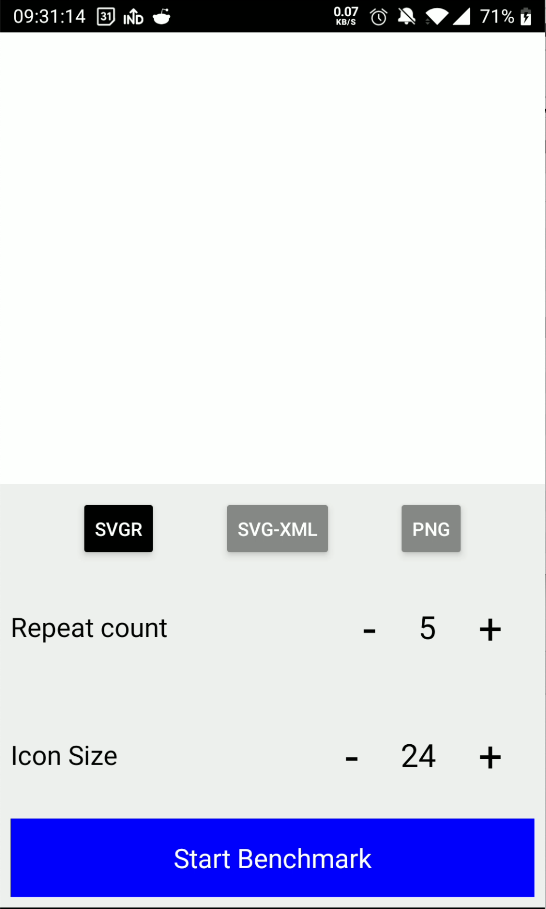
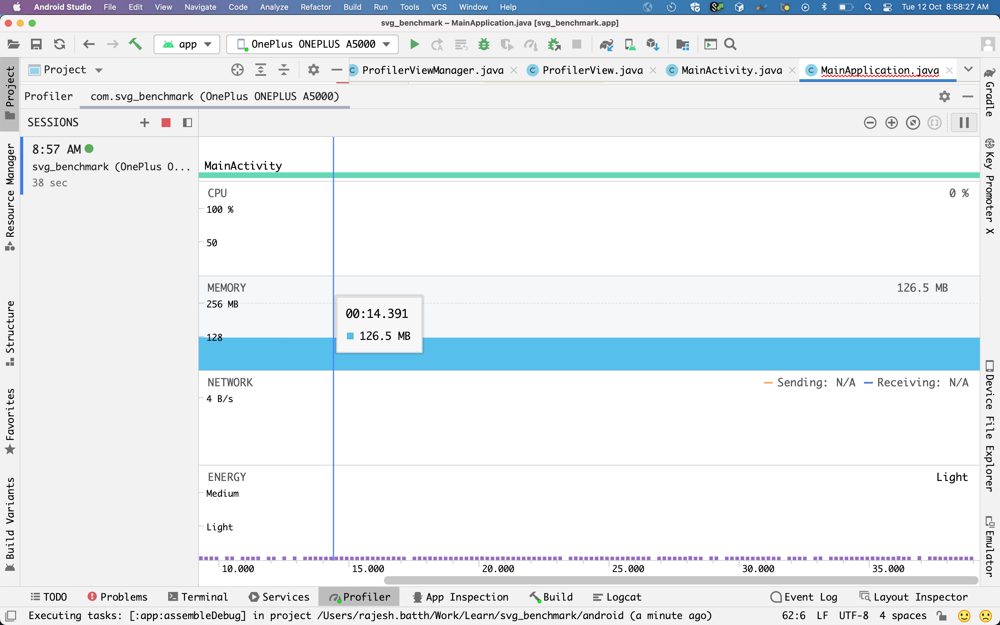
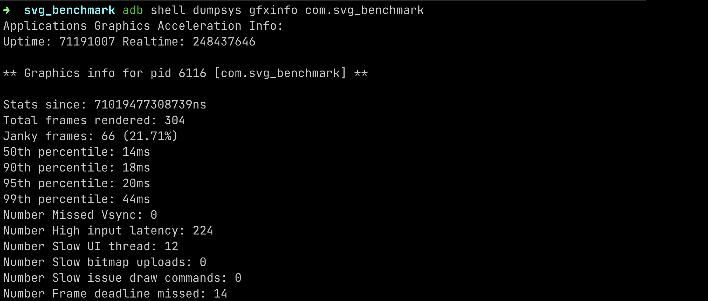

# How to profile

## Prerequisites
1. Build the app and APK -- do not build in debug mode
2. Install the APK on the device ``` ./gradlew installRelease```
3. Open the Android Studio and make sure your device is detected by Android studio, this is needed for profiling

## Step 1: Open the app and set which mode to profile


Select which mode to profile
1. SVGR = SVG React Components
2. SVG-XML = SVG will be sent to Native layer as XML
3. PNG = PNG Icons embedded inside APK

Repeat Count will repeat the list # of times 

Icon size are in pixels. All icons have same height and width

### Do not click "Start Benchmark" yet 

## Step 2: Start the Android Studio Profiler 


## Step 3: Click on the CTA "Start Benchmark"

## Step 4: Use the scroll randomly -- fast scroll, slow scroll, random up/down

## Step 5: Collect the metrics

Stop the Android Studio profiler

Collect peak usage of CPU, Memory from the profiler

For frame-drops, run the following command in terminal

```adb shell dumpsys gfxinfo com.svg_benchmark```

this will output something like below


Note down the `Janky frames` field value, we only need the percentage value, not absolute count.

# For every trail make sure you kill the app at the end. 

